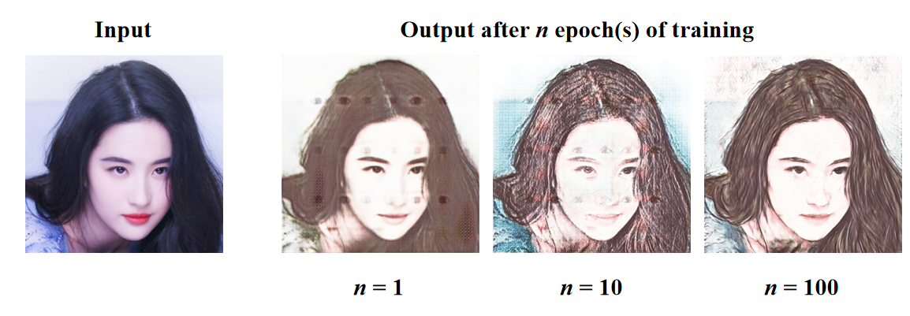

__English__ | [简体中文](docs/README_cn.md)

# Photo to cartoon

## Catalogue

1. [Brief Introduction](#BriefIntroduction)
2. [Effect Display](#EffectDisplay)
3. [File Structure](#FileStructure)
4. [Quick Start](#QuickStart)
5. [References](#References)

## BriefIntroduction

This project is the final assignment of my sophomore deep learning course.
This project contents include:

* Implementation [Pixel2PixelGAN](https://arxiv.org/pdf/1611.07004.pdf);
* Implementation generator network based on [UNet](https://arxiv.org/pdf/1505.04597.pdf);
* Implementation discriminator network based on [FCN](https://arxiv.org/pdf/1411.4038.pdf);
* Train Pixel2PixelGAN on [Photo2Cartoon dataset](https://aistudio.baidu.com/aistudio/datasetdetail/79149);
* Implement a Photo2Cartoon application.

## EffectDisplay



## FileStructure

```
Photo2Cartoon
├── data                 # Dataset code package and dataset
    ├── __init__.py      # Dataset code
    ├── data_process.py  # Data preprocessing program
    ├── data_process.sh  # Data preprocessing script
    └── test.png         # Image for test
├── docs                 # Document folder
    ├── images           # Image folder
        └── demo.png     # Program effect display image
    └── README_cn.md     # Chinese description document
├── networks             # Neural network model code package
    ├── __init__.py      # Generator and Discriminator code
    ├── fcn.py           # FCN code
    ├── nn.py            # Basic code of neural network
    └── unet.py          # UNet code
├── config.py            # Configurations
├── LICENSE              # LICENSE
├── main.py              # Photo2Cartoon application program
├── README.md            # English description document
├── requirements.txt     # List of requirements
└── train.py             # Training program
```

## QuickStart

### 1.Clone

```shell
git clone https://github.com/Yue-0/Photo2Cartoon.git
cd ./Photo2Cartoon
```

### 2.Install requirements

Requirements are include:
* cv2
* tqdm
* numpy
* torch
* torchvision

```shell
pip install -r requirements.txt
```

### 3.Prepare dataset

The dataset used in this project is the open dataset of Baidu AI Studio.
[Go to download it](https://aistudio.baidu.com/aistudio/datasetdetail/79149),
and then place it in the "data" folder.

Data preprocessing:

```shell
cd ./data
sh data_process.sh
```

### 4.Train model

Run [train.py](train.py) to train the model.

```shell
cd ..
python train.py
```

At the end of each epoch of training, the test results of the current
generator model will be saved in the "log" folder.

Some configuration parameters are defined in [config.py](config.py).
You can change them to achieve different effects.
Default configuration:

```python
lr: float = 1e-4        # Learning rate
epoch: int = 100        # Epochs
batch_size: int = 8     # Batch size
l1_lambda: float = 100  # Lambda parameter in Pixel2PixelGAN algorithm

image_size: int = 256   # Size of image

g_channels: int = 512              # The number of channels in the deepest feature map in UNet
d_channels: int = g_channels >> 3  # The number of channels in the first layer feature map in FCN
```

## 5.Inference

Place the images you want to convert in the "inputs" folder,
and run [main.py](main.py) to convert:

```shell
python main.py
```

The results will be saved in the "outputs" folder.

# References

1. Isola P, Zhu J Y, Zhou T, et al. Image-to-Image Translation with Conditional Adversarial Networks.
2. Weng W, Zhu X. INet: Convolutional Networks for Biomedical Image Segmentation.
3. Long J, Shelhamer E, Darrell T. Fully Convolutional Networks for Semantic Segmentation.
4. 钟速. 成对人像卡通化数据集. https://aistudio.baidu.com/aistudio/datasetdetail/79149.
5. minivision-ai: photo2cartoon. https://github.com/minivision-ai/photo2cartoon.
