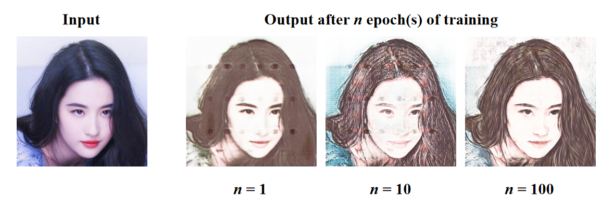

[English](../README.md) | __简体中文__

# 人像照片动漫化

## 目录

1. [简介](#简介)
2. [效果展示](#效果展示)
3. [文件结构](#文件结构)
4. [快速开始](#快速开始)
5. [参考文献](#参考文献)

## 简介

本项目是我深度学习课程的期末作业。
本项目内容包括:

* 实现[Pixel2PixelGAN](https://arxiv.org/pdf/1611.07004.pdf)；
* 基于[UNet](https://arxiv.org/pdf/1505.04597.pdf)实现生成器网络；
* 基于[全卷积网络](https://arxiv.org/pdf/1411.4038.pdf)实现判别器网络；
* 在[成对人像卡通化数据集](https://aistudio.baidu.com/aistudio/datasetdetail/79149)上训练Pixel2PixelGAN；
* 实现一个人像照片动漫化应用。

## 效果展示



## 文件结构

```
Photo2Cartoon
├── data                 # 数据集代码包和数据
    ├── __init__.py      # 数据集代码
    ├── data_process.py  # 数据预处理程序
    ├── data_process.sh  # 数据预处理脚本
    └── test.png         # 测试用的图片
├── docs                 # 文档文件夹
    ├── images           # 图片文件夹
        └── demo.png     # 程序效果展示图片
    └── README_cn.md     # 中文说明文件
├── networks             # 神经网络莫模型代码包
    ├── __init__.py      # 生成器和判别器代码
    ├── fcn.py           # 全卷积神经网络代码
    ├── nn.py            # 神经网络基础代码
    └── unet.py          # UNet代码
├── config.py            # 配置参数
├── LICENSE              # LICENSE文件
├── main.py              # 人像卡通化主程序
├── README.md            # 英文说明文件
├── requirements.txt     # 依赖库列表
└── train.py             # 训练程序
```

## 快速开始

### 1.克隆项目

```shell
git clone https://github.com/Yue-0/Photo2Cartoon.git
cd ./Photo2Cartoon
```

### 2.安装依赖

项目的依赖库包括：
* cv2
* tqdm
* numpy
* torch
* torchvision

```shell
pip install -r requirements.txt
```

### 3.准备数据集

本项目使用的数据集是百度AI Studio的公开数据集。
[点击下载数据集](https://aistudio.baidu.com/aistudio/datasetdetail/79149)，并将其放置在data文件夹中。

数据预处理：

```shell
cd ./data
sh data_process.sh
```

### 4.Train model

运行[train.py](../train.py)来训练模型.

```shell
cd ..
python train.py
```

每轮训练结束时，会将当前生成模型的测试图像生成结果保存在log文件夹中。

[config.py](../config.py)中定义了配置参数，可以通过修改这些参数来获得不同的结果。
默认配置如下：

```python
lr: float = 1e-4        # 学习率
epoch: int = 100        # Epochs
batch_size: int = 8     # Batch size
l1_lambda: float = 100  # Pixel2PixelGAN算法中的lambda参数

image_size: int = 256   # 图像大小

g_channels: int = 512              # UNet最深层特征图的通道数
d_channels: int = g_channels >> 3  # 全卷积网络第一层特征图的通道数
```

## 5.Inference

将需要转换的图片放置在inputs文件夹中，然后运行[main.py](../main.py)开始转换：

```shell
python main.py
```

转换结果将被保存在outputs文件夹中。

# 参考文献

1. Isola P, Zhu J Y, Zhou T, et al. Image-to-Image Translation with Conditional Adversarial Networks.
2. Weng W, Zhu X. INet: Convolutional Networks for Biomedical Image Segmentation.
3. Long J, Shelhamer E, Darrell T. Fully Convolutional Networks for Semantic Segmentation.
4. 钟速. 成对人像卡通化数据集. https://aistudio.baidu.com/aistudio/datasetdetail/79149.
5. minivision-ai: photo2cartoon. https://github.com/minivision-ai/photo2cartoon.
